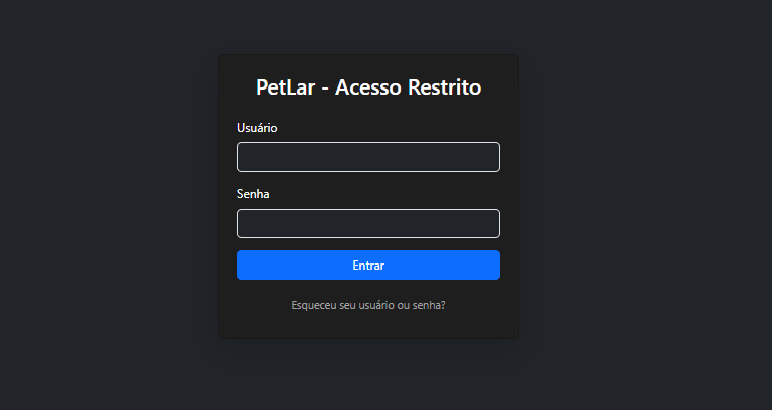
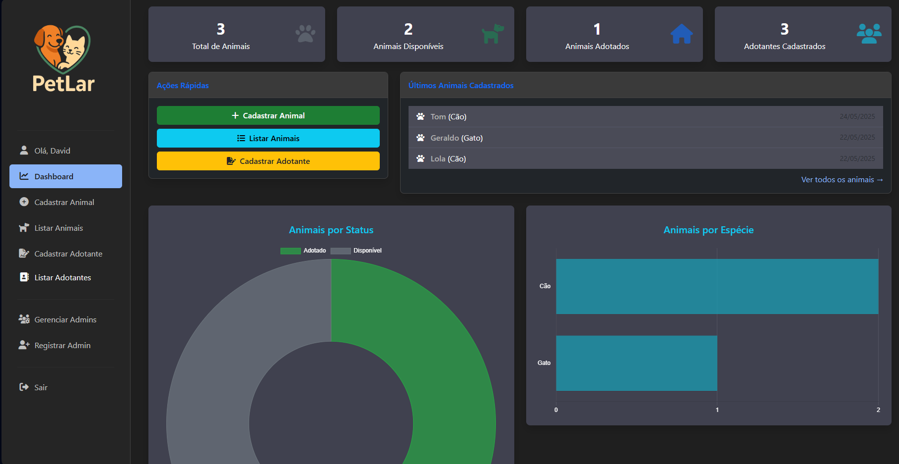
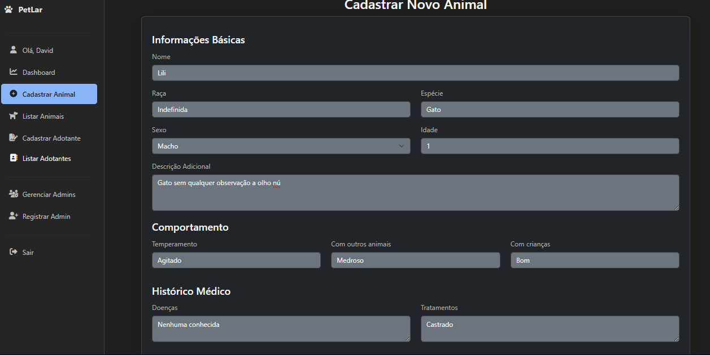
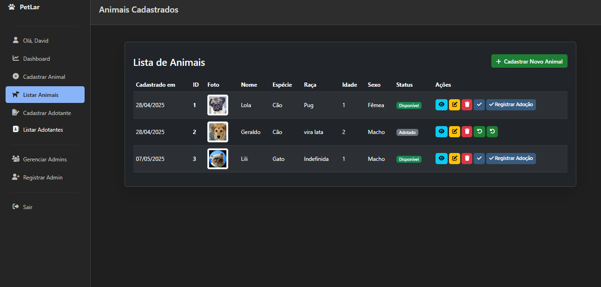
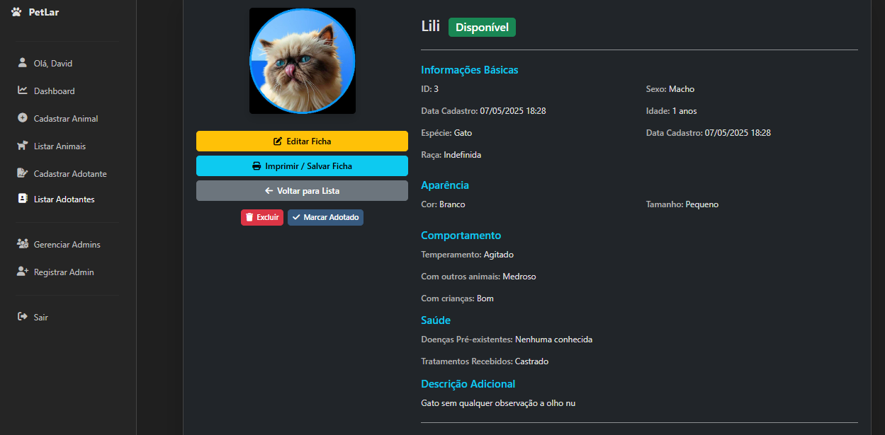

🐾 PetLar – Sistema de Adoção de Animais

PetLar é um sistema web desenvolvido como parte do Projeto Integrador da UNIVESP com o objetivo de otimizar o processo de adoção de animais de uma ONG local. A aplicação busca substituir fichas físicas por uma solução digital segura, padronizada e acessível, facilitando o cadastro, organização e acompanhamento de animais e adotantes.

 
 ### Funcionalidades ###
 
✅ Cadastro completo de animais com foto, características, comportamento e status de adoção.

✅ Cadastro de adotantes com validações, imagem e informações comportamentais.

✅ Autenticação de administradores (login seguro).

✅ Dashboard administrativo com gráficos estatísticos.

✅ Listagem de animais e adotantes com filtros de busca.

✅ Histórico de adoções com rastreabilidade.

✅ Upload de imagens de animais e adotantes.

✅ Interface responsiva com HTML, CSS e JavaScript.

✅ Banco de dados relacional com SQLite.

### Tela de Login


### Dashboard

   
### Cadastro de Animal


### Lista de Animais


### Detalhes do Animal


O sistema PetLar pode ser acessado pelo link:  "https://petlar.onrender.com/login"

###🧱 Estrutura do Projeto: ###

PetLar/

├── app/

│   ├── static/

│   │   ├── css/

│   │   └── images/

│   ├── templates/

│   │   ├── login.html

│   │   ├── dashboard.html

│   │   ├── cadastrar_animal.html

│   │   └── ...

│   ├── models/

│   │   └── models.py

│   ├── routes/

│   │   └── views.py

│   ├── forms.py

│   └── __init__.py

├── database/

│   └── petlar.db

├── tests/

│   └── test_app.py

├── requirements.txt

└── run.py

###🔧 Tecnologias Utilizadas ###

   • Python 3.11

   • Flask

   • SQLite

   • SQLAlchemy

   • HTML/CSS/JS (Bootstrap)

   • Pytest para testes

   • GitHub para versionamento
   
   • Gráficos com Chart.js


### 📄 API RESTful do PetLar ###

O sistema PetLar fornece uma API RESTful para permitir a consulta de dados de animais e, com restrições, de adotantes. Os endpoints retornam dados no formato JSON.

#### Endpoints de Animais

1.  **`GET /api/animais`**: Lista animais cadastrados.
    *   **Método:** `GET`
    *   **Query Parameters Opcionais:**
        *   `status`: Filtra por status de adoção. Valores possíveis: `disponivel`, `adotado`.
            *   Exemplo: `/api/animais?status=disponivel`
        *   `especie`: Filtra por espécie (busca parcial, case-insensitive).
            *   Exemplo: `/api/animais?especie=gato`
        *   `idade_min`: Filtra por idade mínima (inteiro).
            *   Exemplo: `/api/animais?idade_min=2`
        *   `idade_max`: Filtra por idade máxima (inteiro).
            *   Exemplo: `/api/animais?idade_max=5`
        *   `page`: Número da página para paginação (padrão: 1).
            *   Exemplo: `/api/animais?page=2`
        *   `per_page`: Número de itens por página (padrão: 10).
            *   Exemplo: `/api/animais?per_page=5`
    *   **Resposta de Sucesso (200 OK):**
        ```json
        {
          "animais": [
            {
              "id": 1,
              "nome": "Rex",
              "especie": "Cachorro",
              "raca": "Vira-lata",
              "sexo": "Macho",
              "idade": 3,
              "data_cadastro": "2023-10-26T10:00:00",
              "temperamento": "Brincalhão",
              "comportamento_outros": "Sociável",
              "comportamento_criancas": "Bom",
              "doencas_preexistentes": "Nenhuma",
              "tratamentos": "Vermifugado",
              "cor": "Caramelo",
              "tamanho": "Médio",
              "localizacao_texto": "Encontrado perto do Parque Central",
              "descricao": "Muito dócil e adora correr.",
              "foto_url": "http://127.0.0.1:5000/static/uploads/animais/foto_rex.jpg",
              "latitude": -23.550520,
              "longitude": -46.633308,
              "adotado": false
            }
         
          ],
          "total_resultados": 20,
          "pagina_atual": 1,
          "total_paginas": 2,
          "proxima_pagina": 2,
          "pagina_anterior": null
        }
        ```

2.  **`GET /api/animais/<int:animal_id>`**: Retorna os detalhes de um animal específico.
    *   **Método:** `GET`
    *   **Parâmetro de URL:** `animal_id` (inteiro, ID do animal)
    *   **Resposta de Sucesso (200 OK):**
        ```json
        {
          "id": 1,
          "nome": "Rex",
       
          "adotado": true,
          "adotante": { 
            "id": 5,
            "nome_completo": "Maria Silva"
          }
        }
        ```
    *   **Resposta de Erro (404 Not Found):**
        ```json
        {
          "erro": "Animal não encontrado"
        }
        ```

#### Endpoints de Adotantes (Requer Autenticação de Administrador)

*Atenção: O acesso a estes endpoints requer que o usuário esteja logado como administrador no sistema web.*

1.  **`GET /api/adotantes`**: Lista todos os adotantes cadastrados (versão pública com dados limitados).
    *   **Método:** `GET`
    *   **Autenticação:** Sessão de administrador ativa.
    *   **Resposta de Sucesso (200 OK):**
        ```json
        [
          {
            "id": 5,
            "nome_completo": "Maria Silva",
            "foto_pessoal_url": "http://127.0.0.1:5000/static/uploads/adotantes/foto_maria.jpg"
          }
       
        ]
        ```
    *   **Resposta de Erro (401 Unauthorized):**
        ```json
        {
          "erro": "Acesso não autorizado"
        }
        ```

2.  **`GET /api/adotantes/<int:adotante_id>`**: Retorna os detalhes completos de um adotante específico.
    *   **Método:** `GET`
    *   **Parâmetro de URL:** `adotante_id` (inteiro, ID do adotante)
    *   **Autenticação:** Sessão de administrador ativa.
    *   **Resposta de Sucesso (200 OK):**
        ```json
        {
          "id": 5,
          "nome_completo": "Maria Silva",
          "rg": "123456789",
          "cpf": "11122233344",
          
          "foto_pessoal_url": "http://127.0.0.1:5000/static/uploads/adotantes/foto_maria.jpg",
          "foto_local_url": "http://127.0.0.1:5000/static/uploads/adotantes/local_maria.jpg"
        }
        ```
    *   **Resposta de Erro (404 Not Found):**
        ```json
        {
          "erro": "Adotante não encontrado"
        }
        ```
    *   **Resposta de Erro (401 Unauthorized):**
        ```json
        {
          "erro": "Acesso não autorizado"
        }
        ```

### 📶 Funcionalidade IoT (Simulada) - Monitoramento de Suprimentos ###

Para atender ao requisito de IoT do Projeto Integrador, o PetLar implementa um sistema simulado de monitoramento de pontos de alimentação (comedouros e bebedouros) para os animais.

**Como Funciona (Simulação):**

Em vez de utilizar sensores físicos, o sistema permite que administradores e voluntários:

1.  **Cadastrem "Pontos de Alimentação":** Cada ponto (ex: "Comedouro Canil A", "Bebedouro Gato Felix") é registrado no sistema, especificando o tipo de suprimento (ração ou água) e, opcionalmente, o animal específico ao qual está associado ou um local geral.
2.  **Registrem Níveis Manualmente:** Através de uma interface web, os usuários podem:
    *   Atualizar o nível estimado do suprimento em um ponto de alimentação (em percentual, de 0 a 100%).
    *   Marcar um ponto como "Reabastecido", o que automaticamente define o nível para 100%.
    *   Adicionar observações a cada registro.
3.  **Visualizem o Status e Histórico:**
    *   Uma tela de listagem mostra todos os pontos de alimentação, seus níveis atuais (com indicadores visuais, como barras de progresso coloridas) e a data da última verificação/reabastecimento.
    *   Alertas são exibidos para pontos com níveis baixos (ex: abaixo de 25%).
    *   É possível visualizar o histórico de registros de nível para cada ponto, permitindo um acompanhamento ao longo do tempo.

**Objetivo da Simulação:**

Esta funcionalidade demonstra os conceitos chave de um sistema IoT:

*   **Coleta de Dados:** Embora manual, simula a coleta de dados sobre o estado de "coisas" (nível de suprimentos).
*   **Armazenamento e Processamento:** Os dados são armazenados no banco de dados e processados para gerar alertas.
*   **Visualização e Ação:** Os dados são apresentados de forma útil para que os responsáveis possam tomar ações (reabastecer).

Em uma implementação completa com hardware, sensores de peso (para ração) ou nível (para água) enviariam esses dados automaticamente para a API do sistema. A interface de registro manual serve como um substituto para esses sensores no contexto deste projeto.

**Principais Componentes:**

*   **Modelos de Dados:** `PontoAlimentacao`, `RegistroNivelSuprimento`.
*   **Rotas:** Para cadastrar pontos, registrar níveis e visualizar o status/histórico.
*   **Templates:** Interfaces para interação do usuário.